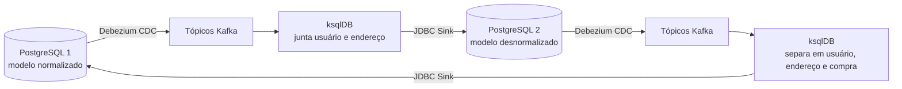

# Kafka Connect: sincronização bidirecional entre bancos

Prova de conceito de **convivência entre dois bancos de dados**: dois PostgreSQL com modelos de dados diferentes ficam sincronizados nos dois sentidos, em tempo quase real. A captura das mudanças é feita com CDC (Debezium), a transformação com ksqlDB e a gravação com Kafka Connect.

É o cenário típico de uma migração gradual de sistema, em que o banco antigo e o novo precisam funcionar ao mesmo tempo até a virada final.

## Arquitetura



Os dois bancos usam modelos diferentes para o mesmo dado:

| PostgreSQL 1 (normalizado) | PostgreSQL 2 (desnormalizado) |
|---|---|
| `USER_`, `USER_ADDRESS`, `USER_PURCHASE` | `USER_INSERT` (usuário e endereço juntos), `USER_PURCHASE2` |

**Sentido 1 → 2:** o Debezium lê o log de escrita (WAL) do PostgreSQL 1 e publica cada inserção num tópico. O ksqlDB junta usuário e endereço, converte os tipos e gera o registro no formato do PostgreSQL 2, que o JDBC Sink grava.

**Sentido 2 → 1:** o mesmo processo ao contrário. O ksqlDB separa o registro desnormalizado nas três tabelas do modelo normalizado.

### Como o projeto evita loop infinito

Numa sincronização nos dois sentidos, um registro copiado de um banco para o outro geraria um novo evento de CDC, que seria copiado de volta, e assim por diante. Para evitar isso, cada tabela tem uma coluna de origem (`USER_ESPA`, `USER_ADDRESS_ESPA`, `USER_PURCHASE_ESPA`):

- o que vai do banco 1 para o banco 2 é gravado com a marca `5000`, e o fluxo 2 → 1 ignora registros com essa marca
- o que vai do banco 2 para o banco 1 é gravado com a marca `6000`, e o fluxo 1 → 2 ignora registros com essa marca

Assim cada alteração atravessa uma vez só.

## Destaques técnicos

- **CDC com Debezium** lendo o WAL do PostgreSQL (`wal_level=logical`, plugin `pgoutput`), sem gatilhos nem consultas periódicas nos bancos
- **Transformação em streaming com ksqlDB**: joins entre streams com janela de tempo, conversão de tipos e filtros pela operação (`op = 'c'`) e pela origem
- **Avro com Schema Registry** para os eventos
- **JDBC Sink Connector** para gravar nos bancos de destino
- **Ambiente 100% automatizado com Docker Compose**: os bancos já sobem com tabelas e dados de exemplo, os conectores são registrados sozinhos e os scripts do ksqlDB são executados na inicialização

## Stack

- Apache Kafka, Kafka Connect e ksqlDB (Confluent Platform 6.2)
- Debezium (PostgreSQL)
- Confluent JDBC Sink Connector
- Schema Registry e Avro
- PostgreSQL
- Docker Compose

## Como rodar

Pré-requisitos: Docker e Docker Compose, com pelo menos 8 GB de memória recomendados para os containers (são 8 serviços).

```bash
git clone https://github.com/igorttosta/Kafka-Connect.git
cd Kafka-Connect
docker compose up -d
```

A inicialização completa leva alguns minutos: os conectores são registrados em sequência e os scripts do ksqlDB rodam depois que o servidor fica pronto.

| Serviço | Endereço |
|---|---|
| Confluent Control Center (tópicos, conectores e ksqlDB) | http://localhost:9021 |
| API do Kafka Connect | http://localhost:8083/connectors |
| ksqlDB | http://localhost:8088 |
| PostgreSQL 1 | `localhost:5432` · banco `mypostgresdb` |
| PostgreSQL 2 | `localhost:5431` · banco `mypostgresdb2` |

Os dois bancos usam o usuário `admin` e a senha `admin`, apenas para o ambiente local.

**Para testar:** insira um usuário com endereço no PostgreSQL 1 e veja o registro aparecer em `USER_INSERT` no PostgreSQL 2. Depois insira em `USER_INSERT` no PostgreSQL 2 e veja os registros aparecerem nas tabelas do PostgreSQL 1.

## Estrutura

```
create-sql/        Tabelas e dados de exemplo de cada banco
kafka-connectors/  Configuração dos conectores Debezium (origem) e JDBC (destino)
ksql/              Streams do ksqlDB de cada sentido da sincronização
execute-scripts.sh Executa os scripts do ksqlDB na inicialização
docker-compose.yml Ambiente completo
```

## Autores

Desenvolvido por **Igor Tosta** ([LinkedIn](https://www.linkedin.com/in/matos-igor-tosta/) · [GitHub](https://github.com/igorttosta)) em parceria com **[Deyllon Ramos](https://github.com/Deyllon)**.
